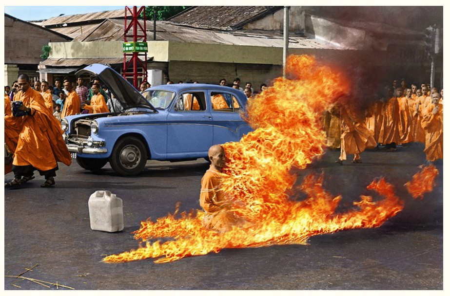

If you ask most people what they want in life, you might get myriad of responses. The drunk will want nothing more than a crunchwrap supreme. The naiive will want to win the powerball. The Lonely will want a family and will settle for a dog. Prisoners will want freedom. So on and so forth. 

What all these answers have in common is an appeasement of the negative emotions

This is what I want:

I really want to feel my flesh burn away

I want the sense of stillness inside 

We all create stories in our head and float away from the objective reality. 