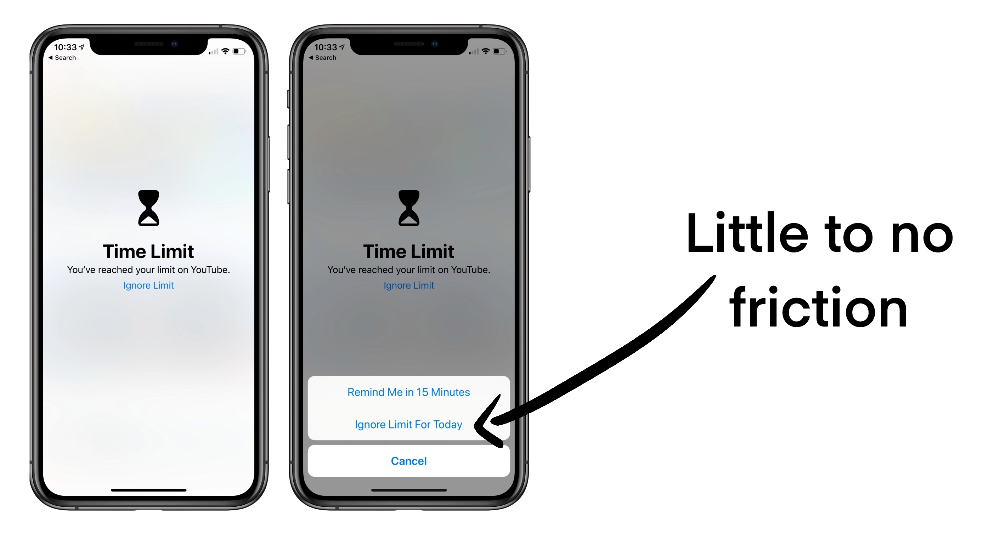
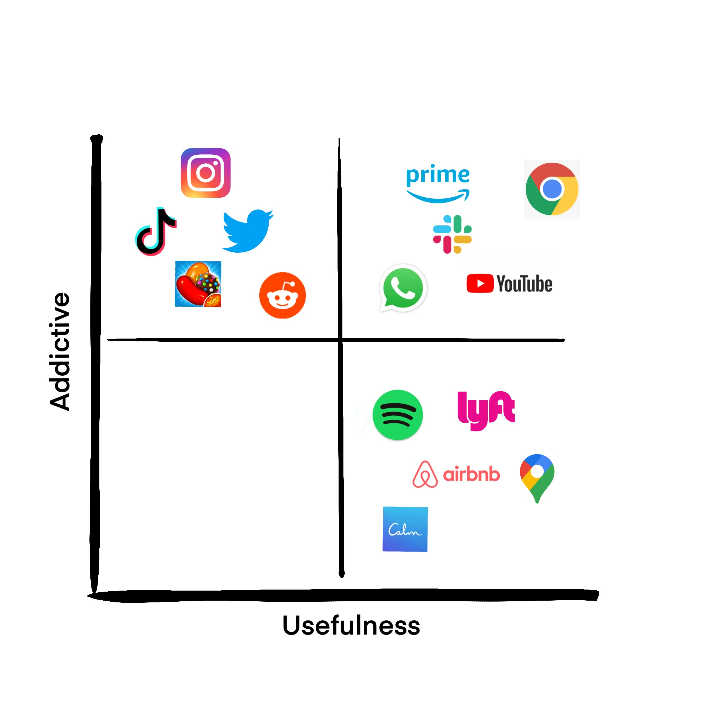

### **Problem** 

Our smartphones are the most useful tool that has simplified our lives in so many ways. However, it has become a source of digital addiction. Over [half of Americans](https://www.statista.com/statistics/1224510/time-spent-per-day-on-smartphone-us/#:~:text=According%20to%20a%20survey%20conducted,average%20on%20their%20phone%20daily.) spend over 6+ hours on their phones. A steady drip of dopamine that dulls greater joys in life such as relationships, emotions and steady growth. How can we manifest a world that has a better relationship with smartphones?

### **Opportunity**

The iPhone is the undisputed category king in the smartphone industry.  Other big players are trying to compete with Apple within the same category rather than defining the next era of smartphones. They each have their own gimmick (better camera, processor, better for games etc) but the marginal improvements are not enough to win the game that Apple has been dominating. A true contender would need to redefine the game to create a strong market share away from Apple.

### **Solution**

Build an operating system that prioritizes digital wellbeing as the primary mission. Not as an add on feature. The current app limit function on iOS does little to deter a user from continuing a TikTok binge.

### **DetoxOS**

The only OS designed to be used less. Similar the Hinge's slogan "designed to be deleted". Hinge realizes that the app is a means to an end to something more meaningful - true relationships. They expect users to delete the app (and forego additional revenue) by valuing the user's long term goals.

With DetoxOS, you can design your own friction and customize according to your usage. Users can work with a specialist to set a custom plan, identify patterns and sign up for proven expert curated frameworks to lower their phone usage over time.

All apps fall into one the quadrants below. How can we find a middle ground where we can continue using useful apps while not letting addictive apps control us?

Great UX is frictionless. DetoxOS intentionally adds friction to prevent binging.

Examples of friction:

-   Routine tasks: Solve stoplight puzzles, math problems, reading comprehension, multiple choice answers, watch a motivational clip etc for every 3 TikToks you watch beyond your daily allotment.
-   Master device: Once the app limit has been reached, the app can only be unlocked from a desktop.
-   Accountability Buddy: Register a friend or family member to keep you honest. They can see your total hours spent on your phone each week and are notified when you go over the limit. If you want to continue binging content beyond your limit, you need to call/text your accountability buddy to extend the limit (social pressure). Once they approve

In each of these situations, the non-essential apps are still available in dire scenarios (highly unlikely). However, the added friction makes it unappealing to continue binging.

We are fighting companies that spend billions on UX R&D. Large companies make money when you spend more time on their apps so they have no incentive to help users moderate their usage. DetoxOS recognizes that our rational brain that prioritizes long term value is overpowered by our emotional brain that wants instant gratification. By creating a framework to slowly lower usage over time, users will get back time in the day to learn, grow and deepen their relationships.

